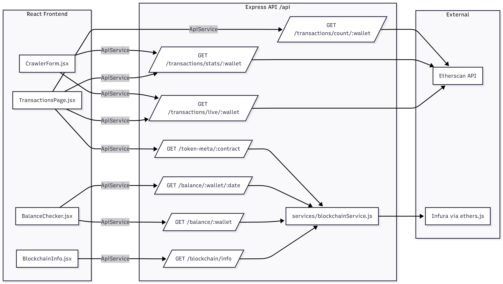
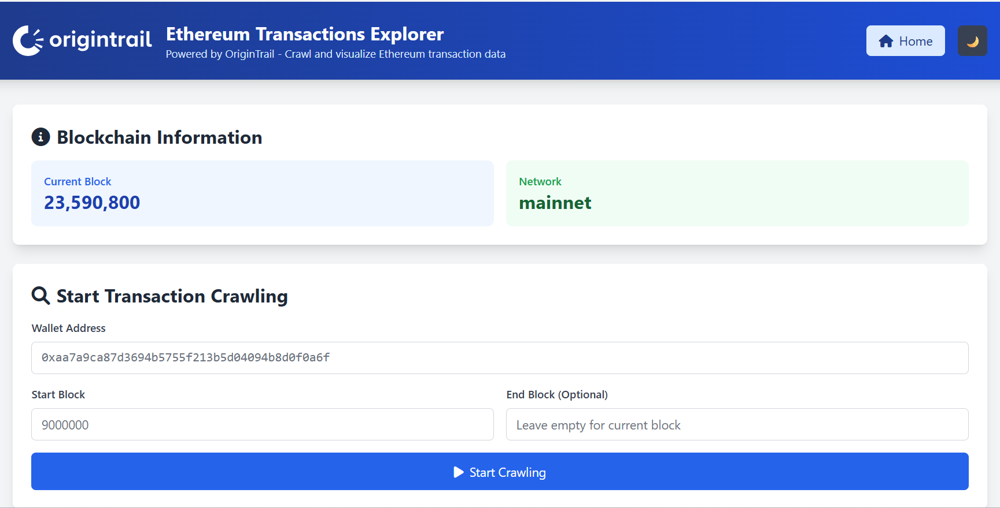

# Ethereum Transactions Explorer

A React web application for exploring and analyzing Ethereum transaction data for any wallet address. The application features a modern React frontend with a Node.js backend, allowing users to search transaction history in real-time, check balances at specific dates, and analyze wallet activity using live blockchain data.

## Features

### Core Features
- **Live Transaction Search**: Search all transactions for a wallet address from a specified starting block using Etherscan API
- **React Frontend**: Modern, responsive React interface with routing and component-based architecture
- **Transaction History**: View detailed transaction history with statistics
- **Real-time Balance**: Check current ETH balance for any wallet address
- **Historical Balance**: Get exact ETH balance at any specific date (YYYY-MM-DD format)
- **Blockchain Integration**: Direct connection to Ethereum mainnet via Infura and Etherscan API

### Additional Features
- **Date-based Balance Lookup**: Find exact ETH balance at any historical date using binary search algorithm
- **Transaction Statistics**: View statistics including total sent/received and volume
- **Recent Searches**: Track previous searches with localStorage integration
- **Dark Mode**: Toggle between light and dark themes
- **Warning System**: Alerts for Etherscan API limits (10,000 transactions)
- **Responsive Design**: Mobile-friendly interface using Tailwind CSS

## Architecture

The high-level architecture and request flow of this app:



## UI Preview



## Testing

The project includes a basic test suite covering core functionality:

- **Unit Tests**: 11 Jest tests covering API endpoints and blockchain service
- **Component Tests**: 4 React component tests for TransactionsPage
- **E2E Tests**: 9 Playwright tests for UI functionality across browsers

**Note**: More comprehensive testing would be beneficial for production, including:
- Additional component tests for all React components
- More API endpoint test coverage
- Integration tests for complex user flows
- Performance testing for large transaction datasets

## Production Notes

For production deployment, consider migrating to TypeScript for better type safety and maintainability:

- Static type checking for API responses and blockchain interactions
- Better IDE support and code completion
- Reduced runtime errors and improved debugging

Migration would involve:
- Converting `.jsx` to `.tsx` files
- Adding type definitions for API responses and component props
- Setting up TypeScript configuration and build process

## Prerequisites

Before running this application, make sure you have:

1. **Node.js** (version 14 or higher)
2. **npm** (comes with Node.js)
3. **Infura Account** (free tier available at [infura.io](https://infura.io))
4. **Etherscan API Key** (free tier available at [etherscan.io](https://etherscan.io))

## Installation

1. **Clone or download the project**
   ```bash
   git clone <repository-url>
   cd eth-project
   ```

2. **Install dependencies**
   ```bash
   npm install
   ```

3. **Set up environment variables**
   
   Create a `.env` file in the root directory:
   ```bash
   cp .env.example .env
   ```
   
   Edit the `.env` file and add your API keys:
   ```env
   INFURA_PROJECT_ID=your_infura_project_id_here
   ETHERSCAN_API_KEY=your_etherscan_api_key_here
   ETHEREUM_NETWORK=mainnet
   PORT=3000
   ```

4. **Get your API Keys**
   
   **Infura Project ID:**
   - Go to [infura.io](https://infura.io) and create a free account
   - Create a new project and select "Ethereum"
   - Copy your Project ID from the project settings
   - Paste it into your `.env` file
   
   **Etherscan API Key:**
   - Go to [etherscan.io](https://etherscan.io) and create a free account
   - Go to API Keys section in your account
   - Create a new API key
   - Copy your API key and paste it into your `.env` file

## Running the Application

### Development Mode
```bash
# Start the backend server (in one terminal)
npm run dev

# Start the React development server (in another terminal)
npm run dev:client
```

- Backend API: `http://localhost:3000`
- React frontend: `http://localhost:3001`

### Production Mode
```bash
# Build the React application
npm run build

# Start the production server
npm start
```

The application will be available at: `http://localhost:3000`

### Running Tests
```bash
# Run unit tests
npm test

# Run e2e tests
npm run test:e2e
```

### Important Notes

- Etherscan API has a 10,000 transactions per request limit. If an address has more than 10,000 transactions in the selected range, results will be truncated. The app shows a warning in that case. For complete coverage of all transactions, narrow the block range (e.g., split the period into multiple smaller ranges).

## Usage

### 1. Searching Transaction History

1. Open the web interface at `http://localhost:3000`
2. Enter a wallet address (e.g., `0xaa7a9ca87d3694b5755f213b5d04094b8d0f0a6f`)
3. Specify the starting block number (e.g., `9000000`)
4. Optionally specify an ending block (leave empty for current block)
5. Click "Start Crawling"

The application will instantly search and retrieve all transactions using the Etherscan API.

### 2. Viewing Transaction History

- After the search completes, you'll be redirected to the transactions page
- View all transactions with detailed information including:
  - Transaction hash (with direct Etherscan links)
  - From/To addresses
  - ETH amounts
  - Transaction type (incoming/outgoing)
  - Block number and date
  - Transaction statistics (total, incoming, outgoing, volume)

### 3. Checking Balances

#### Current Balance
1. Enter a wallet address in the "Balance Checker" section
2. Click "Get Current Balance"
3. View the current ETH balance

#### Historical Balance
1. Enter a wallet address
2. Click "Get Balance at Date"
3. Select a date in YYYY-MM-DD format
4. View the exact balance at that date

## API Endpoints

The application provides a REST API for programmatic access:

### Blockchain Information
- `GET /api/blockchain/info` - Get current blockchain information

### Live Transaction Data
- `GET /api/transactions/live/:walletAddress` - Get live transactions from Etherscan API
- `GET /api/balance/:walletAddress` - Get current balance
- `GET /api/balance/:walletAddress/:date` - Get balance at specific date

## Example Usage

### Getting Live Transactions
```bash
curl "http://localhost:3000/api/transactions/live/0xaa7a9ca87d3694b5755f213b5d04094b8d0f0a6f?startBlock=9000000&endBlock=10000000"
```

### Getting Current Balance
```bash
curl http://localhost:3000/api/balance/0xaa7a9ca87d3694b5755f213b5d04094b8d0f0a6f
```

### Getting Historical Balance
```bash
curl http://localhost:3000/api/balance/0xaa7a9ca87d3694b5755f213b5d04094b8d0f0a6f/2023-01-01
```

## Project Structure

```
eth-project/
├── src/                    # React frontend source code
│   ├── components/         # React components
│   │   ├── Layout.jsx     # Main layout component
│   │   ├── BlockchainInfo.jsx
│   │   ├── CrawlerForm.jsx
│   │   ├── BalanceChecker.jsx
│   │   ├── CrawlHistory.jsx
│   │   └── Loading.jsx
│   ├── pages/             # React pages
│   │   ├── HomePage.jsx
│   │   └── TransactionsPage.jsx
│   ├── services/          # Frontend services
│   │   └── api.js         # API service layer
│   ├── contexts/          # React contexts
│   │   └── DarkModeContext.jsx
│   ├── App.jsx            # Main React app
│   ├── main.jsx           # React entry point
│   └── index.css          # Global styles
├── routes/
│   └── api.js             # API routes
├── services/
│   └── blockchainService.js   # Ethereum blockchain interaction
├── dist/                  # React build output (created after build)
├── server.js             # Main server file
├── vite.config.js        # Vite configuration
├── tailwind.config.js    # Tailwind CSS configuration
├── config.js             # Application configuration
├── package.json          # Dependencies and scripts
└── README.md            # This file
```

## Configuration

The application can be configured through the `config.js` file or environment variables:

- **INFURA_PROJECT_ID**: Your Infura project ID (required)
- **ETHERSCAN_API_KEY**: Your Etherscan API key (required)
- **ETHEREUM_NETWORK**: Ethereum network (default: mainnet)
- **PORT**: Server port (default: 3000)

## Data Storage

The application uses localStorage for storing recent searches and retrieves all transaction data live from the Etherscan API. No local database is required.

## Performance Notes

- **Live API**: All transaction data is retrieved live from Etherscan API for instant results
- **Rate Limiting**: Built-in delays to respect API rate limits
- **Warning System**: Alerts users when Etherscan API limit (10,000 transactions) is reached
- **Efficient Filtering**: Server-side filtering by block range for optimal performance

## Troubleshooting

### Common Issues

1. **"Infura Project ID not configured"**
   - Make sure you've created a `.env` file with your Infura Project ID

2. **"Etherscan API Key not configured"**
   - Make sure you've added your Etherscan API key to the `.env` file

3. **"Failed to initialize Ethereum provider"**
   - Check your internet connection
   - Verify your Infura Project ID is correct

4. **"Invalid wallet address format"**
   - Ensure the wallet address starts with "0x" and is 42 characters long

5. **"Results Limited" warning**
   - This indicates the Etherscan API limit (10,000 transactions) was reached
   - Try narrowing your block range for more specific results

### Getting Help

If you encounter issues:

1. Check the console logs for error messages
2. Verify your Infura account is active
3. Verify your Etherscan API key is valid
4. Ensure you have a stable internet connection
5. Check that the wallet address format is correct

## Security Notes

- Never commit your `.env` file to version control
- Keep your Infura Project ID and Etherscan API key secure
- The application only reads blockchain data (no private keys required)
- All data is retrieved live from APIs (no local storage of sensitive data)

## License

This project is licensed under the ISC License.

## Contributing

Feel free to submit issues and enhancement requests!
